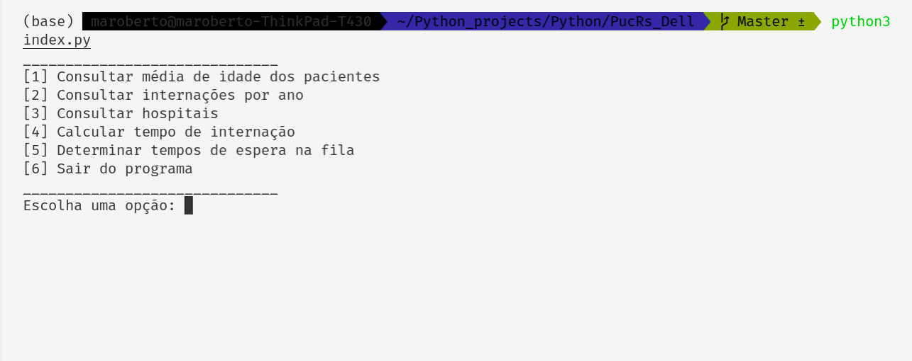
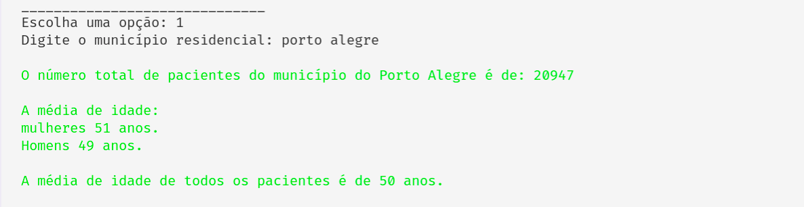

# Programa IT Academy – Processo Seletivo

## Problema
Solução de Problema: Internações em Porto Alegre

## Instruções para executar o codigo

O codigo foi escrito na linguagem Python na versão [python3](https://www.python.org/), para ler e tratar o arquivo CSV, utilizei a biblioteca [Pandas](https://pandas.pydata.org/) através do [Anaconda](https://www.anaconda.com/).

A execução do programa será via terminal, conforme opção contida nas instruções.

## Iniciando o sistema 

Este comando importa a biblioteca pandas

```python
import pandas as pd
```

Com este laço o menu é exibido ao usuário.
```python
# Opções do menu
op = 0
while op != 6:
    print(15 * "__")
    print("[1] Consultar média de idade dos pacientes")
    print("[2] Consultar internações por ano")
    print("[3] Consultar hospitais")
    print("[4] Calcular tempo de internação")
    print("[5] Determinar tempos de espera na fila")
    print("[6] Sair do programa")
    print(15 * "__")

# Entrada do usuário
op = int(input("Escolha uma opção: "))
```

Conforme saída a baixo




Comando para lê o arquivo de dados CSV 
```python
# le os dados contidos no CSV
dados = pd.read_csv("gerint_solicitacoes_mod.csv", encoding="utf-8", sep=";")
```

### 1. Consultar média de idade dos pacientes

Neste primeiro bloco é realizado a verificação de entrada, caso seja válida o sistema passa para o próximo passo.

```python
if op == 1:
    # verifica se o municipio existe
    municipio_very = 0
    while municipio_very == 0:
        municipio = str(input("Digite o município residencial: "))
        cidade_df = dados[["municipio_residencia", "idade", "sexo"]][
            dados["municipio_residencia"] == municipio.upper()
        ]
        municipio_very = cidade_df.shape[0]
        if municipio_very == 0:
            print(
                bcolors.FAIL
                + f"\nNão encontramos {municipio.title()}, digite um municipio valido!"
                + bcolors.CEND
```

Após a verificação, o sistema filtra e organiza os dados para serem exibidos ao usuário.

```python
else:

            # filtra os dados pelo municipio, idade e sexo
            cidade_df = dados[["municipio_residencia", "idade", "sexo"]][
                dados["municipio_residencia"] == municipio.upper()
            ]

            # total dos pacientes
            total_df = cidade_df.shape[0]

            # separa pacientes por gênero
            sexo_f_df = cidade_df[cidade_df["sexo"] == "FEMININO"]
            sexo_m_df = cidade_df[cidade_df["sexo"] == "MASCULINO"]

            # média das idades por gênero e total
            mean_df_f = sexo_f_df["idade"].mean()
            mean_df_m = sexo_m_df["idade"].mean()
            mean_df_g = cidade_df["idade"].mean()

            # imprime o resultado por gênero

            print(
                bcolors.OKGREEN
                + "\nO número total de pacientes do município do {} é de: {:.0f}".format(
                    municipio.title(), total_df
                )
            )
            print(
                "\nA média de idade:\nmulheres {:.2f} anos.\nHomens {:.2f} anos.".format(
                    mean_df_f, mean_df_m
                )
            )
            print(
                "\nA média de idade de todos os pacientes é de {:.2f} anos.".format(
                    mean_df_g
                )
                + bcolors.CEND
```

Saida deste bloco:



### 2. Consultar internações por ano

No inicio do segundo bloco refazemos as verificações para validar as entradas de usuário, logo depois convertermos as datas, filtramos os anos escolhidos e geramos a saida para o usuário.

```python
if op == 2:
        # verifica se o municipio existe
        municipio_very = 0
        while municipio_very == 0:
            municipio = str(input("Digite o município residencial: "))
            cidade_df = dados[["municipio_residencia", "idade", "sexo"]][ dados["municipio_residencia"] == municipio.upper()
            ]
            municipio_very = cidade_df.shape[0]
            if municipio_very == 0:
                print(
                    bcolors.FAIL
                    + f"\nNão encontramos {municipio.title()}, digite um municipio valido!"
                    + bcolors.CEND
                )
            else:


            # converte datas para formato 'datetime64'
            dados["data_internacao"] = dados["data_internacao"].astype("datetime64")
            # dados.dtypes
            cidade_df = dados[["municipio_residencia", "data_internacao"]][
                dados["municipio_residencia"] == municipio.upper()
            ]
            # filtra as internações por ano
            ano_2018 = cidade_df[["data_internacao"]][
                cidade_df["data_internacao"].dt.year == 2018
            ]
            ano_2019 = cidade_df[["data_internacao"]][
                cidade_df["data_internacao"].dt.year == 2019
            ]
            ano_2020 = cidade_df[["data_internacao"]][
                cidade_df["data_internacao"].dt.year == 2020
            ]
            ano_2021 = cidade_df[["data_internacao"]][
                cidade_df["data_internacao"].dt.year == 2021
            ]

            # imprimi o resultado da consulta
            print(
                bcolors.OKGREEN
                + f"\nInternações em {municipio.title()}:\n2018: {ano_2018.shape[0]} \n2019: {ano_2019.shape[0]} \n2020: {ano_2020. shape[0]} \n2021: {ano_2021. shape[0]}"
                + bcolors.CEND
            )
```

Esta é a saida deste bloco, nesta imagem é possível visualizar o alerta de entrada ínvalida, após corrigir, a saida é exibida   


### 3. Consultar hospitais

Neste bloco fizemos novamente a validação e em seguida preparamos a tabela,  onde será exibido os dados filtrados

```python
if op == 3:
        # verifica se o executante existe
        executante_very = 0
        while executante_very == 0:
            # entrada do usuário
            executante = str(
                input(
                    "Digite o nome do executante"
                    + bcolors.OKBLUE
                    + "\nEx.: Hospital Sao Lucas Da PUCRS ou Sao Lucas: "
                    + bcolors.CEND
                )
            )
            executante_df = dados[
                [
                    "idade",
                    "municipio_residencia",
                    "solicitante",
                    "data_autorizacao",
                    "data_internacao",
                    "data_alta",
                    "executante",
                ]
            ][dados["executante"].str.contains(executante.upper())]
            executante_very = executante_df.shape[0]
            if executante_very == 0:
                print(
                    bcolors.FAIL
                    + f"\nNão encontramos {executante.upper()}, digite um executante valido!"
                    + bcolors.CEND
                )
            else:


            # converte datas para formato 'datetime64'
            dados["data_autorizacao"] = dados["data_autorizacao"].astype(
                "datetime64"
            )
            dados["data_internacao"] = dados["data_internacao"].astype("datetime64")
            dados["data_alta"] = dados["data_alta"].astype("datetime64")

            # filtra idade, municipio de residencia, solicitante, data da autorizacao, internação e alta, executante
            executante_df = dados[
                [
                    "idade",
                    "municipio_residencia",
                    "solicitante",
                    "data_autorizacao",
                    "data_internacao",
                    "data_alta",
                    "executante",
                ]
            ]  # [dados["executante"].str.contains(executante.upper)]

            # filtra os Hospitais por nomes ou parte dos nomes
            filter_executante_df = executante_df[
                executante_df["executante"].str.contains(executante.upper())
            ]

            # resultado da consulta
            print(
                bcolors.OKGREEN
                + f"\nNo total o {executante.title()} teve {filter_executante_df.shape[0]} pacientes."
                + bcolors.CEND
            )

            print(filter_executante_df.head())
```

O resultado deste bloco é a tabela abaixo, onde podemos visualizar a busca com usando a função **Contains**, que permite filtrar, por parte do nome. Para otimizar a execução, foram exibidos apenas 5 linhas, porem o total é de 2603 linhas. Neste exemplo, o executante é Hopsital Femina.


### 4. Calcular tempo de internação

Aqui repetimos a validação, as datas são convertidas para fazer o calculo de tempo de internação

```python
if op == 4:
        # verifica se o solicitante existe
        solicitante_very = 0
        while solicitante_very == 0:
            # entrada do usuário
            solicitante = str(
                input(
                    "Digite o nome do solicitante"
                    + bcolors.OKBLUE
                    + "\nEx.: Hospital Sao Lucas Da PUCRS ou Sao Lucas: "
                    + bcolors.CEND
                )
            )
            solicitante_df = dados[
                ["executante", "solicitante", "data_solicitacao", "data_alta"]
            ][dados["solicitante"].str.contains(solicitante.upper())]
            solicitante_very = solicitante_df.shape[0]
            if solicitante_very == 0:
                print(
                    bcolors.FAIL
                    + f"\nNão encontramos {solicitante.upper()}, digite um solicitante valido!"
                    + bcolors.CEND
                )
            else:

                # converte datas para formato 'datetime64'
                dados["data_solicitacao"] = dados["data_solicitacao"].astype(
                    "datetime64"
                )
                dados["data_autorizacao"] = dados["data_autorizacao"].astype(
                    "datetime64"
                )
                dados["data_internacao"] = dados["data_internacao"].astype("datetime64")
                dados["data_alta"] = dados["data_alta"].astype("datetime64")

                # filtra as colunas que seram exibidas
                tempo_df = dados[["executante", "data_solicitacao", "data_alta"]][
                    dados["solicitante"].str.contains(solicitante.upper())
                ]
                # calcula dos dias de internação
                dias_internacao = tempo_df["data_alta"] - tempo_df["data_solicitacao"]
                # inseri os dias de internação na tebela de saida
                tempo_df["dias_internados"] = dias_internacao

                print(
                    bcolors.OKGREEN
                    + f"\nTempo de internação, total de {tempo_df.shape[0]} pacientes"
                    + bcolors.CEND
                )
                print(tempo_df)
```

Mais uma vez testamos se a entrada é invalida, e após a correção, os dados referente, aos dias de internação são exibidos   


### 5. Determinar tempos de espera na fila

Neste último bloco, calculamos os dias de internação, como neste ponto não temos entrada de usuario, apenas exibimos os dados do dataframe geral

```python
if op == 5:
        # converte datas para formato 'datetime64'
        dados["data_solicitacao"] = dados["data_solicitacao"].astype("datetime64")
        dados["data_autorizacao"] = dados["data_autorizacao"].astype("datetime64")
        dados["data_internacao"] = dados["data_internacao"].astype("datetime64")
        dados["data_alta"] = dados["data_alta"].astype("datetime64")

        # filtra os dados por data
        espera_df = dados[["data_solicitacao", "data_internacao"]]
        # calcula dias na fila
        dias_espera = espera_df["data_internacao"] - espera_df["data_solicitacao"]
        # inseri na tabela a nova coluna com dias na fila
        espera_df.insert(2, "dias_na_fila", dias_espera)
        # separa o maoires tempos de internação imprimi
        print(
            bcolors.OKGREEN
            + "\nO cinco maiores tempos de internação são"
            + bcolors.CEND
        )
        print(espera_df[espera_df["dias_na_fila"].between("1200 days", "3000 days")])
    else:
        print(
            bcolors.FAIL + "\nDigite uma opção valida, para continuar!" + bcolors.CEND
        )
```

Aqui é exibido as cinco internações mais longas


### 6. FIM (sair do programa)

```python
print("FIM!")
```

aqui temos um simples print("fim") para sair do programa.


#### Agradecimentos

Gostaria de manifestar a minha satisfação em participar deste processo seletivo, e como estudante em busca de oportinidades, foi um grande desafio executar esta tarefa.

Muito Obrigado, PucRS/Dell e todos os envolvidos neste processo.  

##### contatos:

email: maroberto13@gmail.com

Linkedin: <https://www.linkedin.com/in/marcos-roberto-moreira-4186111b2/>

Github: <https://github.com/maroberto>

Fone/WhatsApp: (11) 95134-0113
